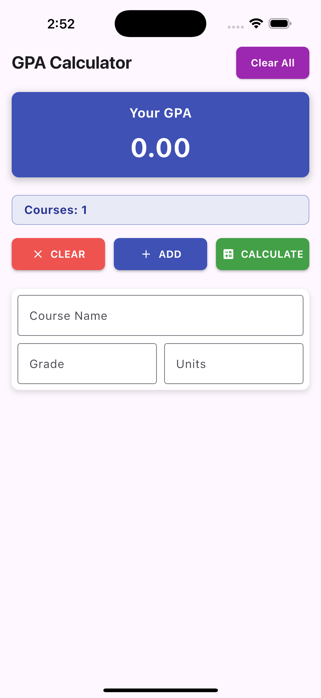

# GPA Calculator App

A modern, user-friendly Flutter application for calculating Grade Point Average (GPA) with data persistence.



## Features

- **GPA Calculation**: Calculate your GPA based on course grades and credit units
- **Data Persistence**: Your courses and GPA are saved automatically between app sessions
- **Dynamic Course Management**: Add and remove courses easily
- **Modern UI**: Clean, intuitive interface with Material Design

## Technologies Used

- **Flutter**: Cross-platform UI toolkit for building natively compiled applications
- **Dart**: Programming language optimized for building mobile, desktop, server, and web applications
- **Bloc Pattern**: State management using the BLoC (Business Logic Component) architecture
- **flutter_bloc**: Implementation of the BLoC pattern for Flutter
- **SharedPreferences**: Local data storage for persisting user data between sessions

## Project Structure

```
lib/
├── Data/
│   └── dataHelper.dart       # Data persistence and GPA calculation logic
├── Screens/
│   ├── Components/
│   │   └── course_Item.dart  # Course item widget for input
│   └── home.dart             # Main screen UI
├── bloc/
│   ├── gpa_cubit.dart        # State management logic
│   └── gpa_state.dart        # State definitions
└── main.dart                 # App entry point
```

## How It Works

1. **Data Model**: The app uses a `Course` class to store course name, grade, and credit units
2. **State Management**: The `GpaAppCubit` manages app state and handles course data operations
3. **Persistence**: `DataHelper` class handles saving and retrieving data using SharedPreferences
4. **GPA Calculation**: Formula multiplies each course’s grade by its units, sums them, and divides by total units

## GPA Calculation Formula

```
GPA = Sum(Course Grade × Course Units) / Sum(Course Units)
```

## Installation

1. Ensure you have Flutter installed on your machine
2. Clone this repository
3. Run `flutter pub get` to install dependencies
4. Connect a device or start an emulator
5. Run `flutter run` to start the app

## Usage

1. Add courses using the "ADD" button
2. Enter course name, grade, and credit units for each course
3. Press "CALCULATE" to compute your GPA
4. Use "CLEAR" to reset all data
5. Your data is automatically saved when you exit the app

## Future Improvements

- Grade letter conversion (A, B, C, etc.)
- Multiple GPA calculation methods
- Semester tracking
- Course categorization
- Export/import functionality

## License

This project is open source and available under the [MIT License](LICENSE).

## Credits

Developed with ❤️ using Flutter and Dart.